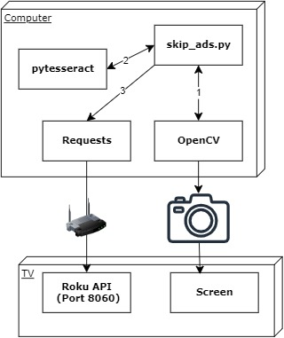

# README
Python script that skips youtube adds automatically when skip button appears on screen.

# Why?
- Youtube plays super long (but skippable with button press) ads on roku tv.
- When I have videos/podcasts playing in the background I'm too lazy to have to find remote and press buton
  
# Usage
- Install [python](https://www.python.org/downloads/)
- Install pytesseract
    - `sudo apt-get install tesseract-ocr`
- Connect webcam and point at lower right of tv screen (where the skip button appears)
- Find your TVs [IP addresss](https://www.lifewire.com/how-to-find-roku-ip-address-4174687) and set `ROKU_IP` env var.
- `git clone https://github.com/Brian-Guenther/skip-youtube-ads-roku-tv.git && cd skip-youtube-ads-roku-tv`
- `pip install -r requirements.txt`
- `python skip_ads.py`

# Troubleshooting
- The image to text recognition works about 50-75% of the time depending on the camera quality and glare/shadows/angle/etc.
- Set `SAVE_PIC` env var to `'true'` and the script will save the image to your execution dir as `captured_image.jpg`
- Set the logger to debug to see what text is actually captured
- Move the camera around while SAVE_PIC is true and make sure you have the SKIP text clearly in frame with minimal blurriness/shadows
- Depending on how many webcams you have connected you may need to change the index from 0 (`cap = cv2.VideoCapture(0)`)

# Design

# References
1. [Roku TV API](https://developer.roku.com/docs/developer-program/dev-tools/external-control-api.md)
